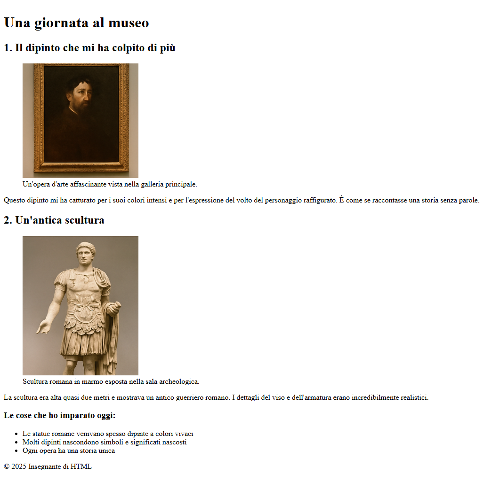

# Una giornata al museo

Esercizio realizzato come parte della lezione di oggi. L'obiettivo è riprodurre il layout fornito utilizzando i tag HTML studiati in classe.

🌐 [Apri la versione online](https://michecosa.github.io/htmlcss-hello)

 

## Struttura del progetto

- **index.html**: pagina principale del sito.  
- **img/**: cartella contenente le immagini locali necessarie per il layout.  

## Requisiti

- Utilizzare **lettere minuscole** per i nomi dei file.  
- Usare i **trattini (-)** al posto degli spazi.  
- Riprodurre il layout mostrato nell'immagine di riferimento allegata.  

## Istruzioni

1. Creare una cartella chiamata `htmlcss-hello`.  
2. All'interno, creare il file `index.html`.  
3. Creare una sottocartella `img/` e inserire al suo interno le immagini fornite (`quadro.png`, `scultura.png`).  

## Obiettivo

Creare una pagina HTML che riproduca fedelmente il layout fornito, seguendo le best practice viste a lezione.

## Immagini in allegato 
  
  

## Schermata da riprodurre

